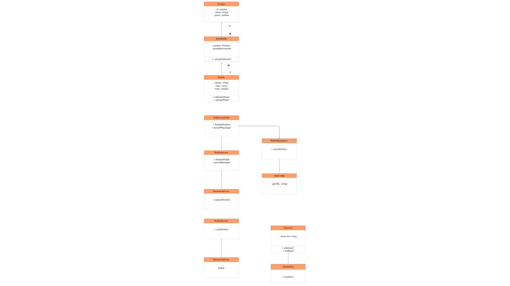
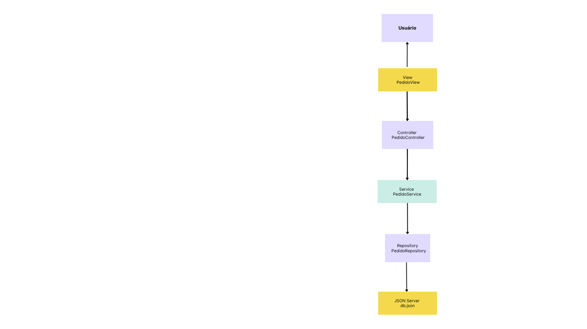

# PRÁTICA ORIENTADA 05 — Arquitetura de Sistemas

Refatoração da Atividade 04 para o padrão MVC.

IFCE Campus Boa Viagem
Professor: Renato William Rodrigues de Souza  
Curso: Análise e Desenvolvimento de Sistemas 
Aluno: Gabriel Uaren 
Turma: 3° Semestre 

---

# Objetivo

Aplicar na prática:
- arquitetura MVC;
- separação de responsabilidades;
- orientação a objetos;
- padrões de projeto;
- desacoplamento;
- organização estrutural;
- refatoração de software.

---

# Arquitetura MVC

O sistema foi reorganizado utilizando o padrão MVC (Model-View-Controller), separando as responsabilidades em diferentes camadas.

## Models
Responsáveis pelas entidades e estrutura de dados:
- Produto;
- Pedido;
- ItemPedido.

## Views
Responsáveis pela interface e renderização das informações.

## Controllers
Responsáveis pelo fluxo da aplicação e comunicação entre View e Services.

## Services
Responsáveis pelas regras de negócio, cálculos e validações.

## Repositories
Responsáveis pela persistência e comunicação com o JSON Server.

---

# Estrutura do Projeto

```text
src/
│
├── models/
├── views/
├── controllers/
├── services/
├── repositories/
├── patterns/
└── app.js
```

---

# Padrões de Projeto Utilizados

## Factory
Utilizado para criação de pedidos.

## Singleton
Utilizado para configuração global da aplicação.

## Strategy
Utilizado para aplicação de descontos.

## Repository
Utilizado para persistência dos dados.

## Observer
Utilizado para atualização da interface.

---

# Fluxo MVC

```text
Usuário
   ↓
View
   ↓
Controller
   ↓
Service
   ↓
Repository
   ↓
JSON Server
```

---

# Integração com JSON Server

O sistema utiliza JSON Server para:
- persistência;
- simulação de backend;
- armazenamento de pedidos;
- requisições HTTP.

---

# Integração com WhatsApp

Foi implementado:
- envio do resumo do pedido;
- geração automática do link wa.me;
- envio para estabelecimento.

---

# Análise Arquitetural

## O MVC melhorou a organização?
Sim. O sistema ficou mais organizado e dividido em responsabilidades específicas.

## O sistema ficou mais desacoplado?
Sim. As camadas ficaram separadas e independentes.

## Onde ainda existem problemas?
Os controllers podem crescer bastante conforme o sistema aumenta.

## O MVC seria suficiente para um sistema muito grande?
Não totalmente. Sistemas maiores normalmente precisam de arquiteturas mais robustas.

## Quais limitações foram percebidas?
- controllers gordos;
- aumento da complexidade;
- dificuldade de manutenção.

## Onde services ajudaram?
Os services centralizaram regras de negócio, validações e cálculos.

## Onde repositories ajudaram?
Os repositories separaram a persistência e o acesso aos dados.

---

# Problemas do MVC Tradicional

- crescimento excessivo dos controllers;
- dificuldade de manutenção;
- aumento do acoplamento;
- excesso de responsabilidades;
- dificuldade de escalabilidade.

---

# Comparação Arquitetural

| Critério | Sistema Original | MVC Refatorado |
|---|---|---|
| Organização | Baixa | Alta |
| Coesão | Média | Alta |
| Acoplamento | Alto | Médio |
| Reutilização | Baixa | Alta |
| Clareza estrutural | Média | Alta |
| Escalabilidade | Média | Melhor |
| Facilidade de manutenção | Baixa | Alta |

---

# Diagramas

## Diagrama de Classes



## Fluxo MVC



---

# Como Executar

## Instalar dependências

```bash
npm install
```

## Iniciar JSON Server

```bash
npx json-server db.json
```

## Executar o sistema

```bash
node src/app.js
```

---

# Tecnologias Utilizadas

- JavaScript
- Node.js
- JSON Server
- Git

  ## Refatoração MVC concluída
- ## Refatoração MVC concluídaGitHub
- MVC
```
